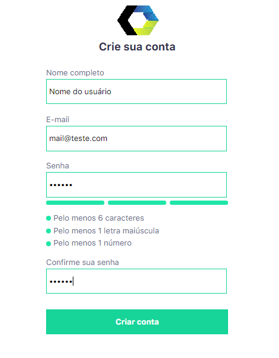

# Example Creating User Accounts (Frontend in Web Components)

Frontend using the development of pure web components, presenting a screen for customer registration, in which validations are performed in the fields for the correct submission of the registration request.

The project does not use any features like Reatc, Vue, Angular, Polymer, etc. Only Javascript with Polyfill is used.

The project is internationalized however, only for English and Portuguese languages (uses the information of the browser you are accessing to set the language).

The following components were created:

> - button
Component that will render a button with its functionality

> - image
Component that will render an image (in this case svg) with its functionality

> - indicator
Component that will render password rule validation indicators with their functionality

> - input
Component that will render input form fields with their functionality

> - text
Component that will render simple text with its functionality

> - register
Grouping element of the other components, it deals with all the business logic and manipulation of the other elements.


The service displays the following screen (assuming the node server at http://localhost:8080):



> The following validations are performed:

- Name field with at least one character
- Valid Email Field
- Password Rules:
  a) At least one uppercase character
  b) at least one number
  c) At least 6 characters
- Password confirmation field same as password field

After fulfilling these requirements the button to create the account is released to click.

## Installing / Getting started

To start in your node server:

- Instal Node.js, [see instructions](https://nodejs.org/en/download/)

- To start your Node server:

  * Install dependencies with `npm install`
  * Start node server with `npm run dev`
  Now you can visit [`localhost:8080`](http://localhost:8080) from your browser.

## Developing

### Built With

The following dependencies were used:

    "babel-core": "^6.26.3",
    "babel-plugin-transform-runtime": "^6.23.0",
    "babel-preset-env": "^1.7.0",
    "babel-preset-es2015-ie": "^6.7.0",
    "babel-preset-stage-0": "^6.24.1",
    "babel-preset-stage-1": "^6.24.1",
    "babel-preset-stage-2": "^6.24.1",
    "babel-preset-stage-3": "^6.24.1",
    "chai": "^4.2.0",
    "copy-webpack-plugin": "^5.0.4",
    "css-loader": "^1.0.1",
    "extract-text-webpack-plugin": "^3.0.2",
    "file-loader": "^2.0.0",
    "html-loader": "^0.5.5",
    "jasmine": "^3.4.0",
    "karma": "^4.3.0",
    "karma-chrome-launcher": "^3.1.0",
    "karma-edge-launcher": "^0.4.2",
    "karma-firefox-launcher": "^1.2.0",
    "karma-jasmine": "^2.0.1",
    "karma-opera-launcher": "^1.0.0",
    "karma-sourcemap-loader": "^0.3.7",
    "karma-spec-reporter": "0.0.32",
    "karma-webpack": "^4.0.2",
    "style-loader": "^0.23.1",
    "webpack-dev-server": "^3.1.5"
    "@webcomponents/custom-elements": "^1.2.1",
    "@webcomponents/webcomponentsjs": "^2.1.3",
    "babel-loader": "^7.1.5",
    "babel-plugin-transform-custom-element-classes": "^0.1.0",
    "babel-polyfill": "^6.26.0",
    "babel-runtime": "^6.26.0",
    "compression-webpack-plugin": "^1.1.11",
    "eslint": "^5.9.0",
    "eslint-plugin-jsx-a11y": "^6.1.2",
    "image-webpack-loader": "^4.5.0",
    "preload-webpack-plugin": "^2.3.0",
    "script-ext-html-webpack-plugin": "^2.0.1",
    "style-ext-html-webpack-plugin": "^3.4.7",
    "to-string-loader": "^1.1.5",
    "webcomponents": "^0.1.4",
    "webcomponents-loader": "^1.0.1",
    "webpack": "^4.40.2",
    "webpack-cli": "^3.1.0",
    "webpack-merge": "^4.2.2"

All of which are automatically installed with the command:
```shell
npm install
```

### Prerequisites
What is needed to set up the dev environment.

- Instal Node.js, [see instructions](https://nodejs.org/en/download/)

- To start your node server:
  * Install dependencies with `npm install`

### Setting up Dev

Here's a brief intro about what a developer must do in order to start developing
the project further:

```shell
git clone https://github.com/orlandopamplona/frontend_webcomponent.git
cd olist-frontend-webcomponents
npm install
npm run dev
```

### Deploying / Publishing

```shell
npm run build
npm run start
```

For the production environment you must create the following environment variable to indicate the backend path:
```shell
API_BACKEND_DOMAIN
```
Exemplo:
API_BACKEND_DOMAIN = 'http://localhost:4000/api'

## Running tests

First have an environment (docker or local machine) with the browsers that will be used in the tests, such as:
- Chrome
- Firefox
- edge
- Opera

If you only want to run the tests for a specific browser, change the karma.conf.js file on the following line:

```shell
browsers: ["Chrome", "Firefox", "Edge", "Opera"]
```

For example, to run for Chrome only:
```shell
browsers: ["Chrome"]
```

Specifically for Opera, if you get any errors, you may need to create the following environment variable (path according to your environment):

```shell
set "OPERA_BIN = C: \ Program Files (x86) \ Opera \ launcher.exe"
```

After this, at the root of the project, run the following command:

```shell
npm run test
```
